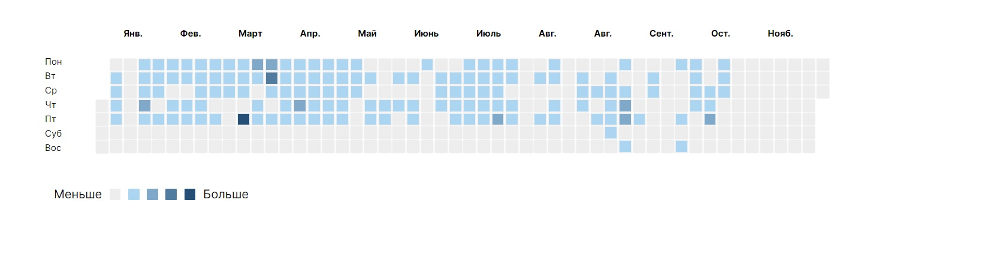

# Contribution's Heatmap

## Table of contents

-   [Overview](#overview)
    -   [The challenge](#the-challenge)
    -   [Screenshot](#screenshot)
    -   [Links](#links)
-   [My process](#my-process)
    -   [Built with](#built-with)
    -   [What I learned](#what-i-learned)
    -   [Continued development](#continued-development)
    -   [Useful resources](#useful-resources)
-   [Author](#author)
-   [Acknowledgments](#acknowledgments)

## Overview

### The challenge

Users should be able to:

-   View each day's contribution amount, and date on hover
-   Each day should color palette depending on the amount of contributions
-   See hover states for all interactive elements on the page
-   The calender should go back and show data for the last 357 days
-   On the calender today's date should be the last one
-   Automatically get json data from url for display
-   Design should follow the figma design
-   Only for desktop resolution

-   Figma Design: [Figma design url](https://www.figma.com/file/shD187YQ4zeQ6x2DGN6avE/%D0%A2%D0%B5%D1%81%D1%82%D0%BE%D0%B2%D0%BE%D0%B5-%D0%B7%D0%B0%D0%B4%D0%B0%D0%BD%D0%B8%D0%B5?node-id=0%3A1)

-   URL for data: [JSON data url](https://dpg.gg/test/calendar.json)

### Screenshot

<p float="left">
  
</p>


### Links

-   Solution URL: [Add solution URL here](https://github.com/coder-96/contributions-graph)
-   Live Site URL: [Add live site URL here](https://coder-96.github.io/contributions-graph/)

## My process

### Built with

-   HTML5
-   CSS3
-   Flexbox
-   CSS Grid
-   JavaScript

### What I learned

Improved my javascript, css skills once again, and gained more knowledge overall on JS and CSS.

```js
            day.addEventListener("mouseover", () => {

                // const weekdayNames = ["Sunday","Monday","Tuesday","Wednesday","Thursday","Friday","Saturday"];
                const weekdayNames = ["Вс","Пн","Вт","Ср","Чт","Пт","Суб"];
                const theDay = weekdayNames[currentDate.getDay()];

                // const monthNames = ["January","February","March","April","May","June","July","August","September","October","November","December"];
                const monthNames = ["Январь","Февраль","Март","Апрель","Май","Июнь","Июль","Август","Сентябрь","Остябрь","Ноябрь","Декабрь"];
                const theMonth = monthNames[currentDate.getMonth()];

                day.innerHTML += `<div id="tk1" class="pop-up"><span>${commitCount} contributions</span>,<br> ${theDay}, ${theMonth} ${currentDate.getDate()}, ${currentDate.getFullYear()}</div>`;
                // day.style.color='green'">Click for green</button>

                const divStyle = document.getElementById("tk1");
                divStyle.setAttribute("style", "background-color: black; opacity: .8;");
            });
```

```js
    const margin = 18.4;
    if (START_DATE.getDay() < 1){
        var dayDiff = 6
    } else if (START_DATE.getDay() > 1)
        dayDiff = START_DATE.getDay() - 1;
    
    if (START_DATE.getDay() !== 1) {
        container.firstElementChild.style.marginTop=`${margin*dayDiff}px`;
    } 
```

### Continued development

I'm focused on perfecting my skills by building more realistic projects.

### Useful resources

-   [MDN Web Docs](https://developer.mozilla.org/en-US/) - helped me find answers when I got stuck.

## Author

-   Website - [Jalga](https://github.com/coder-96)

## Acknowledgments

I thank my family for supporting me on my way to becoming a Developer.
